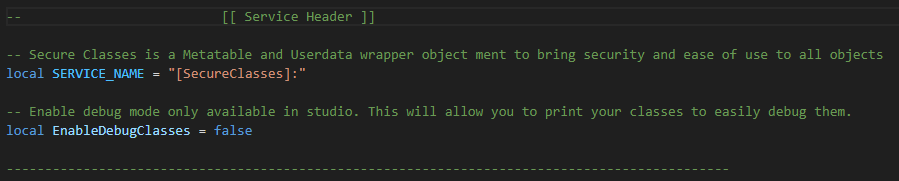

# Debug Mode
Introduced in `V: 2.2.0`. Debug allows you to block the assignment of the `__metatable` and `__tostring` property. This allows the user to print the object and analyze the internal structure.

:::caution Note
This does **NOT** bypass the __index function. while when the `__metatable` metamethod is unassigned you are able to call `getmetatable(MT)` to print its contents. **HOWEVER**, debug mode is only available in the `stuido` enviorment and using getmetatable to access the metatable **WILL** cause runtime errors in production.
:::

:::tip Production
Debug mode is only available in the `studio` enviorment and when in production will automataically revert to using proper protections with flags assigned
:::

## Activation:

Debug mode is activated by setting the `EnableDebugClasses` flag to `true` *the default is false* inside of the `SecureClasses` module under the `Service Header` tag.

### [Line number hyperlink](https://github.com/Green-Screen/SecureClasses/blob/main/src/init.luau#L22)



--------
## Production:

:::info Structure
The structure of a [SecuredMetatable](/api/SecuredMetatable) object is more complex then being shown. Most data is stored in the metatable portion, while all: `Private`, `Default` (including methods/functions) are stored in the `__metadata` dictionary.
:::
--------

#### EnableDebugClasses = FALSE


```lua
--- EnableDebugClasses Flag set to FALSE

local Class = SecuredClasses({}, {}, "Test")

print(Class, getmetatable(Class)) -- Test, Test
```

--------
#### EnableDebugClasses = TRUE

```lua
--- EnableDebugClasses Flag set to TRUE

local Class = SecuredClasses({}, {}, "Test")

print(Class, getmetatable(Class)) -- {}, {}
-- Note the metatable structure is more intracate then what im willing to type out on this.
```